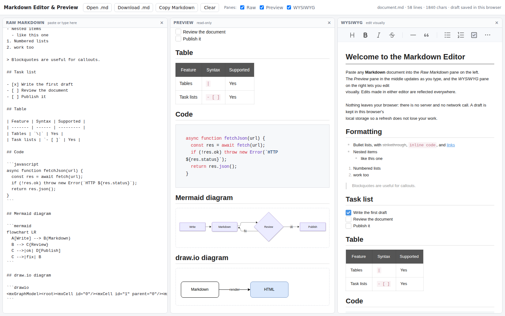

# Markdown Editor & Preview

A small, self-contained, in-browser Markdown editor for teams migrating wiki pages
from Confluence to GitLab / GitHub wikis. Paste the Markdown of a wiki page, see it
rendered instantly, and edit it either as raw text or in a WYSIWYG view. Everything
stays in memory in the browser: there is no server component and no network call
at runtime.



## Features

- **Three synchronised panes**: Raw Markdown (editable) · Preview (read-only) · WYSIWYG (editable).
  A change in either editor updates the other two panes live.
- **GitLab / GitHub Flavored Markdown**: tables, task lists, fenced code, strikethrough, autolinks.
- **Syntax highlighting** for fenced code blocks (highlight.js, common languages).
- **Mermaid diagrams** in ```` ```mermaid ```` blocks, rendered in the preview.
- **draw.io diagrams** in ```` ```drawio ```` blocks (paste the diagram XML, `<mxfile>` or
  `<mxGraphModel>`, compressed or plain), rendered in the preview with the draw.io viewer.
- **File actions**: Open a local `.md` file (button, drag & drop, or Ctrl+O), Download as `.md`
  (Ctrl+S), Copy Markdown to clipboard, Clear.
- **Draft kept in the browser** (localStorage) so a refresh does not lose work.
- **Pane toggles**: close any pane with the × in its header or the checkboxes in the toolbar;
  the remaining panes take up the freed space. The layout is remembered between visits.

## Security posture

Built for locked-down corporate networks:

- No CDN. All JavaScript is bundled into `dist/` at build time and served from the same
  place as `index.html`. The build makes **no outbound request** at runtime (verified with
  a headless browser during development).
- Every piece of rendered HTML goes through [DOMPurify](https://github.com/cure53/DOMPurify) 3.x
  (`script`, `iframe`, `style`, inline event handlers, `javascript:` links etc. are stripped).
  Toast UI's own bundled sanitiser is bypassed in favour of the current DOMPurify release.
- Mermaid runs with `securityLevel: 'strict'`.
- Toast UI Editor usage statistics (a call to Google Analytics) are switched off.
- The draw.io viewer is pinned to local asset paths (`public/vendor/drawio/...`) so it
  never contacts `diagrams.net`. Lightbox / "edit in draw.io" links are disabled.
- Nothing is uploaded anywhere. Content lives in memory and in the browser's local storage only.

## Getting started

Requires Node.js 18+ and npm.

```bash
npm install
npm run dev        # http://localhost:5173 with hot reload
npm run build      # static output in dist/
npm run preview    # serve the built dist/ locally on http://localhost:4173
```

### Deploying

`dist/` is plain static files (relative paths, no server logic). Copy it to any static host:
GitLab Pages, GitHub Pages, an internal web server, or a file share served over HTTP.

> The page must be served over `http(s)://`. Opening `index.html` directly from `file://`
> is blocked by browsers for ES modules. `npx serve dist` or `python3 -m http.server -d dist`
> is enough for a quick local run.

## Project layout

```
index.html                 app shell (toolbar + three panes)
src/main.js                editor wiring, pane sync, file actions, persistence
src/diagrams.js            preview post-processing: highlight.js, mermaid, draw.io
src/style.css              layout & theme
src/sample.md              sample document shown on first visit
public/vendor/drawio/      draw.io viewer (Apache-2.0, from jgraph/drawio), served as-is
vite.config.js             build config (relative base path)
```

## Libraries

| Library | Purpose | Licence |
| --- | --- | --- |
| [@toast-ui/editor](https://github.com/nhn/tui.editor) 3.x | Markdown parsing, preview rendering, WYSIWYG editing | MIT |
| [DOMPurify](https://github.com/cure53/DOMPurify) 3.x | HTML sanitisation | Apache-2.0 / MPL-2.0 |
| [highlight.js](https://highlightjs.org/) 11.x | code syntax highlighting | BSD-3-Clause |
| [mermaid](https://mermaid.js.org/) 12.x | Mermaid diagrams (loaded lazily, only when a diagram is present) | MIT |
| [draw.io viewer](https://github.com/jgraph/drawio) `viewer-static.min.js` | draw.io diagrams (loaded lazily) | Apache-2.0 |
| [Vite](https://vitejs.dev/) | dev server & bundler (dev dependency only) | MIT |

Package `overrides` in `package.json` pin transitive dependencies to patched releases;
`npm audit` reports no known vulnerabilities at the time of writing.

## Notes and known limitations (iteration 1)

- **WYSIWYG normalises Markdown.** Editing in the WYSIWYG pane re-generates the Markdown
  from the visual model, so formatting choices such as `-` vs `*` bullets or heading styles
  may be rewritten. The raw pane is only rewritten when the change originates in the
  WYSIWYG pane, never while you are typing in the raw pane.
- **draw.io shapes**: the bundled viewer covers the standard shape set. Diagrams that use
  external stencil libraries (AWS, Azure, Cisco …) would normally fetch those from
  diagrams.net; here they are pointed at `public/vendor/drawio/stencils` and
  `public/vendor/drawio/shapes`. Copy the matching folders from the
  [drawio repository](https://github.com/jgraph/drawio/tree/dev/src/main/webapp) into
  `public/vendor/drawio/` if you need them.
- **Math in draw.io diagrams** needs MathJax, which is not bundled. See
  `public/vendor/drawio/math4/es5/startup.js` for how to drop it in.
- **Images and attachments** referenced with relative paths (e.g. `uploads/…` or
  `diagram.drawio.svg`) cannot be resolved because there is no wiki repository behind the
  editor; they render as broken images in the preview. Absolute URLs work.
- Mermaid diagrams are rendered in the preview only; in the WYSIWYG pane they appear as an
  editable code block, which keeps the source intact when converting back to Markdown.
- Single document at a time, no multi-tab or scroll sync yet.
