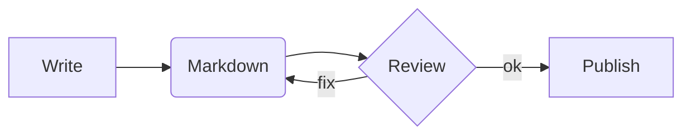

# Welcome to the Markdown Editor

Paste any **Markdown** document into the *Raw Markdown* pane on the left.
The *Preview* pane in the middle updates as you type, and the *WYSIWYG* pane on the right lets you edit
visually. Edits made in either editor are reflected everywhere.

Nothing leaves your browser: there is no server and no network call. A draft is kept in this browser's
local storage so a refresh does not lose your work.

## Formatting

- Bullet lists, with ~~strikethrough~~, `inline code`, and [links](https://commonmark.org/help/)
- Nested items
  - like this one
1. Numbered lists
2. work too

> Blockquotes are useful for callouts.

## Task list

- [x] Write the first draft
- [ ] Review the document
- [ ] Publish it

## Table

| Feature | Syntax | Supported |
| ------- | ------ | --------- |
| Tables | `\|` | Yes |
| Task lists | `- [ ]` | Yes |

## Code

```javascript
async function fetchJson(url) {
  const res = await fetch(url);
  if (!res.ok) throw new Error(`HTTP ${res.status}`);
  return res.json();
}
```

## Mermaid diagram



## draw.io diagram

```drawio
<mxGraphModel><root><mxCell id="0"/><mxCell id="1" parent="0"/><mxCell id="2" value="Markdown" style="rounded=1;whiteSpace=wrap;html=1;" vertex="1" parent="1"><mxGeometry x="20" y="20" width="120" height="50" as="geometry"/></mxCell><mxCell id="3" value="HTML" style="rounded=1;whiteSpace=wrap;html=1;fillColor=#dae8fc;strokeColor=#6c8ebf;" vertex="1" parent="1"><mxGeometry x="240" y="20" width="120" height="50" as="geometry"/></mxCell><mxCell id="4" value="render" style="edgeStyle=orthogonalEdgeStyle;rounded=0;html=1;" edge="1" parent="1" source="2" target="3"><mxGeometry relative="1" as="geometry"/></mxCell></root></mxGraphModel>
```
